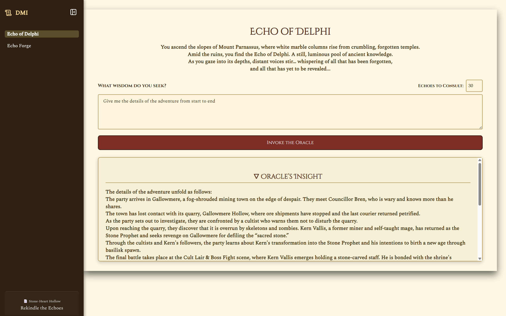

# DMI (Dungeon Master Intelligence)


DMI is a Gen-AI powered assistant for Dungeon Masters running D&D games. It combines RAG (Retrieval-Augmented Generation) with LLMs to provide responses from your campaign documents and generate D&D ideas, inspiration and content.

## Technologies Used

### Backend
- Flask for API server
- ChromaDB for vector storage
- Instructor for structured LLM outputs
- Langchain for document processing
- Ollama and llama.cpp (allows more configuration) for LLM inference

### Frontend
- React with Vite
- Axios for API calls
- Custom themed CSS
- React Markdown
- Lucide icons


## Features

### Echo of Delphi
- Gen-AI powered question answering about your campaign
- Context-aware responses using your campaign documents
- Source references for answers
- Adjustable context length for questions
- Can be used to help supplement the writing process of adventures

### Echo Forge
- Generate D&D content with campaign context:
  - NPCs with personalities and secrets
  - Locations with descriptions and rumors
  - Puzzles with solutions and hints
  - Magic items with effects
  - Local rumors and plot hooks
  - Fantasy names with cultural context

### RAG System
- Document indexing and retrieval using ChromaDB
- Markdown-based campaign document integration
- Smart context selection for queries
- Header-based document chunking

## Getting Started

### Prerequisites

- Python 3.12+ for backend
- Node.js 18+ for frontend
- CUDA-capable GPU (optional, for local models)
- Ollama or local GGUF models

## Project Structure

```
dmi/
├── backend/               # Flask server and AI components
│   ├── llm/               # LLM interaction models
│   ├── rag/               # RAG implementation
│   └── server.py          # Flask API
└── frontend/              # React application
    ├── src/
    │   ├── components/    # React components
    │   └── App.jsx        # Main app
    └── public/            # Static assets
```
> More details are are provided in backend/README.md and frontend.md

## Example - Echo of Delphi



## Example - Echo Forge

